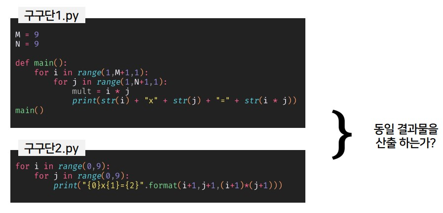

# CodeAI
Code similarity Detection AI Contest - [DACON Ranked #9](https://dacon.io/competitions/official/235900/overview/description)   
Project presentation file - Team ETC code similarity detection.pdf 




## Environment
- GPU : NVIDIA Tesla V100 x 2
- Cuda 11.2
- python 3.7.13
- torch 1.9.0
- pandas 1.3.4
- numpy 1.20.3
- datasets 2.2.1
- transformers 4.19.0
- tqdm 4.64.0
- scikit-learn 1.0.2

## Pre-processing
```
python preprocessing.py
```

## Training
- codet5 model
```
python train_codet5.py
```

- graphcodebert model
```
python train_graphcodebert.py
```

## Test

- codet5 model
```
python test_split.py

# change test1 -> test2, test3, test4
python test_codet5.py 
```

- graphcodebert model
```
python test_graphcodebert.py
```


